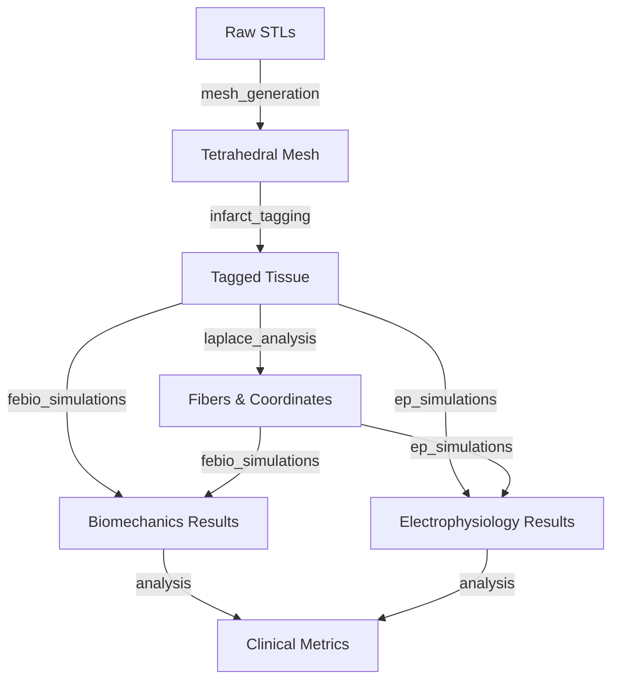

```markdown
# SCD Cardiac Modeling & Simulation Pipeline

This repository contains a complete computational pipeline for processing patient-specific cardiac geometries (SCD patients). The pipeline handles mesh generation, infarct tissue tagging, fiber reconstruction, and dual-physics simulations (Biomechanics via FEBio and Electrophysiology via OpenCARP), specifically focusing on hydrogel patch optimization.

## Table of Contents
- [Pipeline Overview](#pipeline-overview)
- [Directory Structure](#directory-structure)
- [Prerequisites](#prerequisites)
- [Configuration](#configuration)
- [Usage Guide](#usage-guide)
    - [1. Mesh Generation](#1-mesh-generation)
    - [2. Infarct Tagging & Fiber Reconstruction](#2-infarct-tagging--fiber-reconstruction)
    - [3. FEBio Biomechanics](#3-febio-biomechanics)
    - [4. OpenCARP Electrophysiology](#4-opencarp-electrophysiology)
    - [5. Analysis](#5-analysis)
- [File Manifest](#file-manifest)

## Pipeline Overview

The data flow moves from raw STL files to simulation-ready volumetric meshes, and finally to simulation results.



## Directory Structure

*   **`mesh_generation/`**: Algorithms for converting surface meshes to high-quality tetrahedral meshes.
*   **`injection_site__infarct_tagging/`**: Scripts for assigning tissue types (Healthy, Border, Scar), computing transmural coordinates, and reconstructing myofibers.
*   **`simulations/febio_simulations/`**: Dynamic cardiac mechanics simulations and hydrogel patch parametric sweeps.
*   **`simulations/ep_simulations/`**: OpenCARP simulation setups for Pseudo-ECG, Calcium Transients, and S1-S2 protocols.
*   **`simulations/analysis/`**: Post-processing scripts to generate clinical metrics and visualizations.

## Prerequisites

### Software
*   **Python 3.8+**
*   **FEBio 4.0+** (Binary must be in path or configured in scripts)
*   **OpenCARP v18.1+** (for EP simulations)
*   **TetGen** (for meshing fallback)
*   **MMG3D** (for mesh optimization)

### Python Libraries
```bash
pip install numpy scipy pandas matplotlib meshio wildmeshing pymeshlab
```

## Configuration

> **⚠️ Important:** The scripts currently use hardcoded paths (e.g., `/home/shadeform/SCD_MODELS`). 
> 
> Before running any scripts, you **must** update the `BASE_DIR` variable in the header of the python scripts to match your local environment.

## Usage Guide

### 1. Mesh Generation
Located in `mesh_generation/`.
Converts processed triangular meshes (STLs) into simulation-quality tetrahedral meshes.

*   **Final Algorithm:** `final_mesh_gen.py`
*   **Process:** Repairs surface -> Generates Tet mesh (fTetWild) -> Optimizes quality (Jacobian/Aspect Ratio) -> Extracts surfaces.
*   **Output:** `simulation_ready/{patient_id}_tet.pts` and `.elem`.

```bash
python3 mesh_generation/final_mesh_gen.py
```

### 2. Infarct Tagging & Fiber Reconstruction
Located in `injection_site__infarct_tagging/`.
Assigns tissue properties and fiber orientations.

*   **Tissue Classification:** Run `trial_3_infarct_detection_comprehensive.py`.
    *   Uses wall thickness gradients and anatomical constraints to tag Infarct (3), Border Zone (2), and Healthy (1) tissue.
*   **Laplace Analysis:** Run `trial_FINAL_laplace_complete_v2.py`.
    *   Solves Laplace-Dirichlet for transmural coordinates.
    *   Generates helical fiber vectors (`.lon` files).
    *   Optimizes injection sites based on geodesic distance and wall stress.

```bash
python3 injection_site__infarct_tagging/trial_FINAL_laplace_complete_v2.py
```

### 3. FEBio Biomechanics
Located in `simulations/febio_simulations/`.

*   **Baseline Dynamics:** `run_dynamic_febio_simulations.py`
    *   Runs a full cardiac cycle (1 second) with time-varying pressure.
    *   Generates P-V loops and regional strain analysis.
*   **Hydrogel Sweep:** `parametric_patch_sweep.py`
    *   Runs 140 configurations per patient varying stiffness, thickness, and coverage of hydrogel patches.

```bash
# Run baseline simulations
python3 simulations/febio_simulations/run_dynamic_febio_simulations.py

# Run patch optimization sweep
python3 simulations/febio_simulations/parametric_patch_sweep.py
```

### 4. OpenCARP Electrophysiology
Located in `simulations/ep_simulations/`.

*   **Complete Workflow:** `complete_missing_ep_workflow.py`
    *   Calculates Pseudo-ECGs using a lead field method.
    *   Generates parameter files for Calcium Transients.
    *   Generates S1-S2 vulnerability protocols to test for arrhythmia.

```bash
python3 simulations/ep_simulations/complete_missing_ep_workflow.py
```

### 5. Analysis
Located in `simulations/analysis/`.

*   **Baseline Metrics:** `Baseline_Metrics_Analysis.py`
*   **Patch Analysis:** `Patch_Sweep_Analysis.py`
*   **Real Baseline:** `Real_Baseline_Analysis.py`

These scripts ingest the JSON/CSV outputs from the simulations and generate matplotlib figures comparing strains, ejection fractions, and border zone mechanics.

```bash
python3 simulations/analysis/Baseline_Metrics_Analysis.py
```

## File Manifest

| File | Description |
| :--- | :--- |
| `mesh_generation/final_mesh_gen.py` | FINAL meshing algorithm (fTetWild + Optimization). |
| `mesh_generation/mesh_diagnostic_1.py` | Detailed mesh quality analyzer (Jacobian, Dihedral, etc). |
| `injection_site.../trial_3_infarct...py` | Multi-metric infarct detection logic. |
| `injection_site.../trial_FINAL...v2.py` | FINAL Laplace-Dirichlet & Fiber generation script. |
| `simulations/febio.../run_dynamic...py` | Main FEBio simulation runner. |
| `simulations/ep.../complete_ep_outputs.py` | Main OpenCARP simulation runner and ECG calculator. |
```
